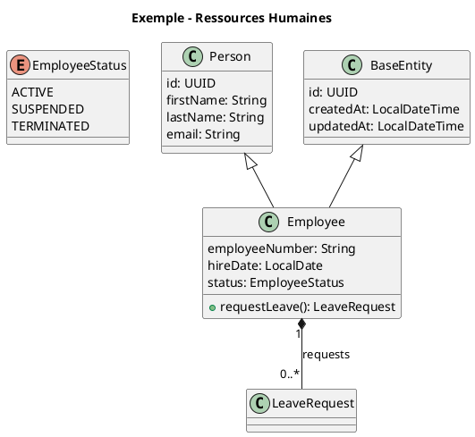

# Diagrammes UML - StarUML (Version Améliorée)

Ce dossier contient des diagrammes UML **améliorés** avec héritage et enums, optimisés pour StarUML.

---

## 📁 Structure

```
staruml-simple/
├── usecases/
│   ├── usecase-authentification.puml
│   ├── usecase-rh.puml
│   ├── usecase-finance.puml
│   ├── usecase-education.puml
│   ├── usecase-organisation.puml
│   └── usecase-documents.puml
├── classes/
│   ├── class-authentification.puml
│   ├── class-rh.puml
│   ├── class-finance.puml
│   ├── class-education.puml
│   ├── class-organisation.puml
│   └── class-documents.puml
├── usecases-combines.puml
├── classes-combines.puml
└── README.md
```

---

## 🎯 Améliorations apportées

### ✅ Héritage (Généralisation)

| Classe Parent | Classes Enfants |
|---------------|-----------------|
| `Person` | `Employee`, `Teacher`, `Student` |
| `BaseEntity` | Toutes les entités métier |
| `BaseAuditEntity` | Entités avec audit |

### ✅ Enums (Types énumérés)

#### Authentification
- `RoleType` : ADMIN, EMPLOYEE, MANAGER, HR, ACCOUNTANT
- `PermissionType` : READ, WRITE, DELETE, ADMIN

#### Ressources Humaines
- `EmployeeStatus` : ACTIVE, SUSPENDED, TERMINATED, ON_LEAVE
- `LeaveStatus` : PENDING, APPROVED, REJECTED, CANCELLED
- `AttendanceStatus` : PRESENT, ABSENT, LATE, REMOTE
- `ReviewStatus` : DRAFT, IN_PROGRESS, COMPLETED
- `ObjectiveStatus` : NOT_STARTED, IN_PROGRESS, ACHIEVED, FAILED

#### Finance
- `InvoiceStatus` : DRAFT, SENT, PAID, OVERDUE, CANCELLED
- `PaymentMethod` : CASH, BANK_TRANSFER, CREDIT_CARD, CHECK
- `ExpenseCategory` : SALARY, RENT, UTILITIES, TRAVEL, EQUIPMENT
- `ExpenseStatus` : PENDING, APPROVED, REJECTED, PAID

#### Éducation
- `ProgramLevel` : BEGINNER, INTERMEDIATE, ADVANCED, EXPERT
- `EnrollmentStatus` : PENDING, ACTIVE, COMPLETED, DROPPED_OUT
- `GradeStatus` : GRADED, PENDING, EXCUSED

#### Organisation
- `AssetCategory` : COMPUTER, VEHICLE, FURNITURE, EQUIPMENT, SOFTWARE
- `AssetStatus` : AVAILABLE, ASSIGNED, IN_REPAIR, RETIRED
- `ProjectStatus` : PLANNING, IN_PROGRESS, ON_HOLD, COMPLETED, CANCELLED
- `ProjectPriority` : LOW, MEDIUM, HIGH, CRITICAL

#### Documents
- `DocumentType` : CONTRACT, INVOICE, DIPLOMA, CERTIFICATE, REPORT, POLICY
- `DocumentCategory` : HR, FINANCE, LEGAL, TECHNICAL, ADMINISTRATIVE
- `DocumentStatus` : DRAFT, PENDING_SIGNATURE, SIGNED, ARCHIVED, EXPIRED
- `JournalEntryType` : DEBIT, CREDIT, ADJUSTMENT

---

## 🔧 Comment utiliser dans StarUML

### Importation

1. **Ouvrez StarUML**
2. **File → Import → PlantUML...**
3. Sélectionnez un fichier `.puml`
4. Le diagramme est généré automatiquement !

### Fichiers disponibles

| Fichier | Description | Complexité |
|---------|-------------|------------|
| `classes/class-rh.puml` | RH complet avec enums | ⭐⭐⭐ |
| `classes/class-finance.puml` | Finance avec Money VO | ⭐⭐⭐ |
| `classes/class-education.puml` | Éducation avec héritage Person | ⭐⭐⭐ |
| `classes/class-organisation.puml` | Organisation complète | ⭐⭐⭐ |
| `classes/class-authentification.puml` | Auth avec RoleType enum | ⭐⭐ |
| `classes/class-documents.puml` | Documents avec versioning | ⭐⭐ |
| `classes-combines.puml` | **TOUS** les modules | ⭐⭐⭐⭐⭐ |

---

## 📊 Résumé des diagrammes

### Classes par module

| Module | Classes | Enums | Relations |
|--------|---------|-------|-----------|
| Authentification | 4 | 2 | 3 |
| RH | 6 | 5 | 5 |
| Finance | 5 | 4 | 3 |
| Éducation | 6 | 3 | 5 |
| Organisation | 6 | 4 | 3 |
| Documents | 3 | 4 | 1 |
| **Total** | **30** | **22** | **20** |

---

## 🎨 Conventions UML utilisées

### Notation d'héritage
```
Person <|-- Employee
```
`<|--` signifie "hérite de" (flèche triangulaire dans StarUML)

### Notation de composition
```
Employee "1" *-- "0..*" LeaveRequest : "requests"
```
`*--` signifie "contient" (losange noir)

### Notation d'agrégation
```
CourseModule "0..*" --> "1" Teacher : "taught by"
```
`-->` signifie "utilise" (flèche simple)

### Enums
```plantuml
enum EmployeeStatus {
  ACTIVE
  SUSPENDED
  TERMINATED
}
```

---

## 💡 Exemple de code complet



---

## 🌐 Utiliser avec PlantUML en ligne

1. Allez sur : **https://www.plantuml.com/plantuml/**
2. Copiez le contenu d'un fichier `.puml`
3. Collez dans l'éditeur
4. Cliquez sur **"Generate PNG"**
5. Téléchargez l'image

---

## ⚠️ Notes importantes

### Pour l'export PNG dans VS Code
Si vous avez l'erreur `Cannot run program "/opt/local/bin/dot"` :

**Solution 1 :** Installer Graphviz
```bash
sudo apt-get install graphviz
```

**Solution 2 :** Utiliser le serveur PlantUML
Dans `settings.json` VS Code :
```json
{
  "plantuml.render": "PlantUMLServer"
}
```

**Solution 3 :** Utiliser le site en ligne (recommandé)
https://www.plantuml.com/plantuml/

---

## 📝 Intégration dans un mémoire

### Exemple de légende

```
Figure 3.8 - Diagramme de classes : Module Ressources Humaines

Ce diagramme présente la structure du module RH :
- La classe Employee hérite de Person (nom, prénom, email)
- L'enum EmployeeStatus gère le cycle de vie (ACTIVE, SUSPENDED, TERMINATED)
- Les relations de composition (*) lient Employee à ses entités associées
- Salary est une composition forte (1 employé = 1 salaire)
- LeaveRequest, Attendance, PerformanceReview, Objective sont des collections
```

---

## 🆘 Dépannage StarUML

### Les enums ne s'affichent pas correctement ?
- Vérifiez que le mot-clé `enum` est utilisé (pas `class`)
- Dans StarUML, right-click sur l'enum → Format → Stereotype → «enumeration»

### Les flèches d'héritage sont inversées ?
- La notation correcte est : `Parent <|-- Enfant`
- La flèche pointe vers le parent

### Les relations ne sont pas visibles ?
- Ajustez la disposition avec **Auto Layout** (Tools → Auto Layout)
- Déplacez les classes manuellement si nécessaire

---

**Format :** PlantUML  
**Compatible :** StarUML 3.x+, VS Code PlantUML, plantuml.com  
**Encodage :** UTF-8  
**Langue :** Français
